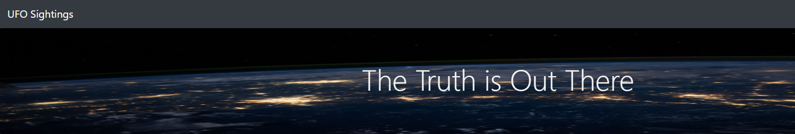
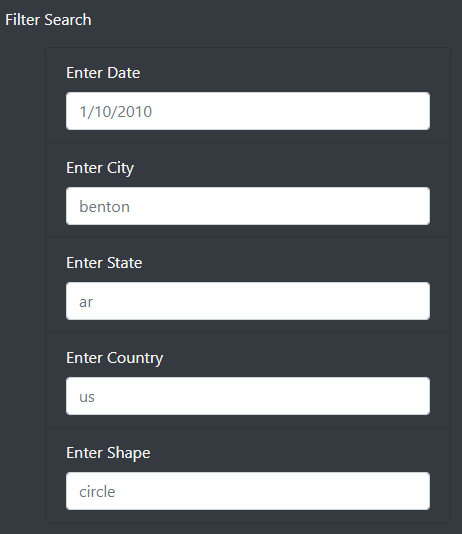
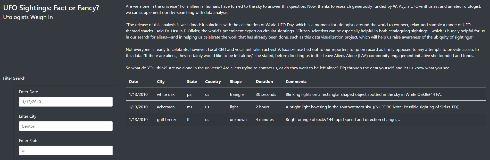
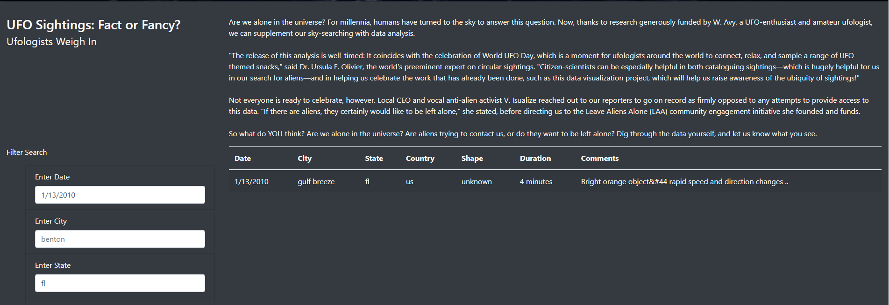

# UFO Sightings with JavaScript (Module 11)

[Link to app.js code](static/js/app.js)

[Link to style.css code](static/css/style.css)

[Link to index.html code](index.html)

## Overview of UFO Sightings Analysis

### Purpose
Provide an in-depth analysis of UFO sighting data by allowing users to filter for multiple criteria at the same time. 

Using JavaScript and HTML coding, users can filter UFO sighting data based on the following criteria:

* Date
* City
* State
* Country
* Object Shape

## Results

A user can query the UFO sighting data by typing one or more search criteria field and pressing enter.  

Placeholders have been added in each search criteria field to indicate the formatting that should be used when querying the dataset.

For example, entering the date of 1/13/2010 pressing enter yields the following three results:

The search can be further refined by entering the state of Florida (fl), yielding one result:

### Summary

1. One drawback of this UFO Sightings website is that the search entries need to be typed in the exact format as the underlying dataset.  For example, the state must be entered as two lowercase letters.  Entering a state's proper name, or with two uppercase letters, will yield incorrect search results.

2. Two recommendations for further development are to consider adding 1] data validation to the input fields to ensure only valid values and formats are entered and/or drop-down capabilities to the input fields so the user can select from available data; and 2] adding a "search now" button for the user to push after entering all relevant search criteria instead of pressing enter.

### Resources

This project was prepared using the following:
* JavaScript ES6
* HTML
* Bootstrap
* CSS
* D3.js

